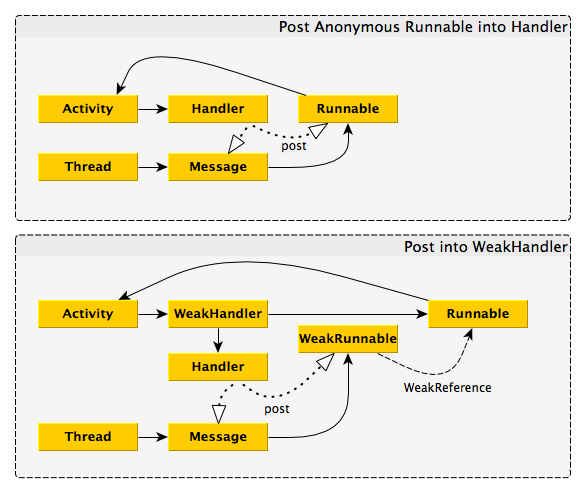

Android Weak Handler
====================

Memory safer implementation of android.os.Handler

Problem
-------

Original implementation of Handler always keeps hard reference to handler in queue of execution.
Any object in Message or Runnable posted to `android.os.Handler` will be hard referenced for some time.
If you create anonymous Runnable and call to `postDelayed` with large timeout, that Runnable will be held
in memory until timeout passes. Even if your Runnable seems small, it indirectly references owner class,
which is usually something as big as Activity or Fragment.

You can read more [on our blog post](https://medium.com/bumble-tech/android-handler-memory-leaks-7291c5be6101).

Solution
--------

`WeakHandler` is trickier than `android.os.Handler` , it will keep `WeakReferences` to runnables and messages,
and GC could collect them once `WeakHandler` instance is not referenced any more.



Usage
-----
Add JitPack repository to your build.gradle:
```groovy
repositories {
    maven { url 'https://jitpack.io' }
}

dependencies {
    implementation 'com.github.badoo:android-weak-handler:1.3'
}
```

Use WeakHandler as you normally would use Handler

```java
import com.badoo.mobile.util.WeakHandler;

public class ExampleActivity extends Activity {

    private WeakHandler handler; // We still need at least one hard reference to WeakHandler

    protected void onCreate(Bundle savedInstanceState) {
        handler = new WeakHandler();
        ...
    }

    private void onClick(View view) {
        handler.postDelayed(new Runnable() {
            view.setVisibility(View.INVISIBLE);
        }, 5000);
    }
}
```

Credits
-------
Weak Handler is brought to you by [Badoo Trading Limited](https://corp.badoo.com) and it is released under the [MIT License](https://opensource.org/licenses/MIT).

## Blog
Read more on our [tech blog](http://techblog.badoo.com/) or explore our other [open source projects](https://github.com/badoo)
